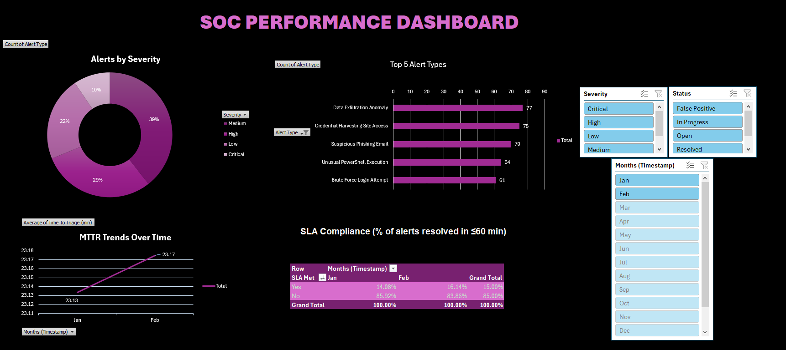

# SOC Metrics Dashboard (Excel)

An interactive Excel dashboard built to simulate Security Operations Center (SOC) performance tracking. Designed to visualize alert volume, mean time to respond, severity distribution, and SLA adherence.

## 📊 Features
- **Alerts by Severity** – Pie chart breakdown of High/Medium/Low.
- **Top 5 Alert Types** – Bar chart of most frequent detections.
- **MTTR Trends** – Line chart showing Mean Time to Triage and Resolve over months.
- **SLA Compliance** – % of alerts resolved within 60 minutes.
- **Interactive Slicers** – Filter by Severity, Status, and Month – all charts update dynamically.

## 🧪 Data
500 rows of simulated alert data with the following fields:
- Timestamp, Alert Type, Severity, Status, Time to Triage (min), Time to Resolve (min)

## 🛠️ How to Use
1. Download `SOC_Alert_Data.xlsx`
2. Open in Excel (2016 or later recommended).
3. Enable macros? Not needed – all PivotTables and slicers are pre‑connected.
4. Use slicers to explore different views.

## 📁 Files
- `SOC_Alert_Data.xlsx` – main dashboard file
- `dashboard_screenshot.png` – preview image

## 🎯 Purpose
This project demonstrates:
- Advanced Excel (PivotTables, slicers, data modeling)
- SOC metric awareness (MTTR, severity, SLA)
- Ability to turn raw data into actionable visual insights

## 📬 Contact
Ashik Arif – [LinkedIn](https://linkedin.com/in/ashikarif)  
🔗 This project is part of my cybersecurity portfolio.
